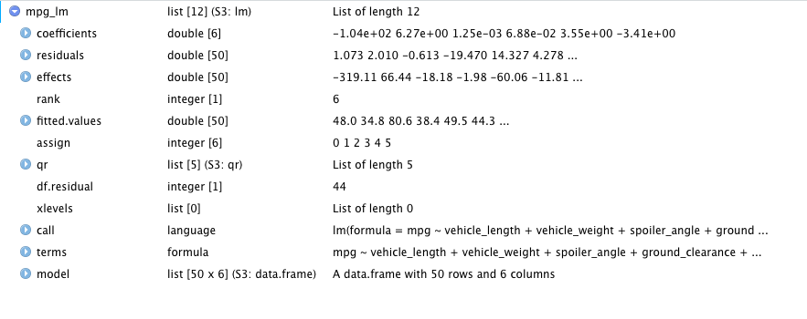
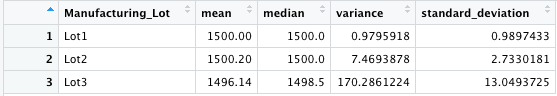
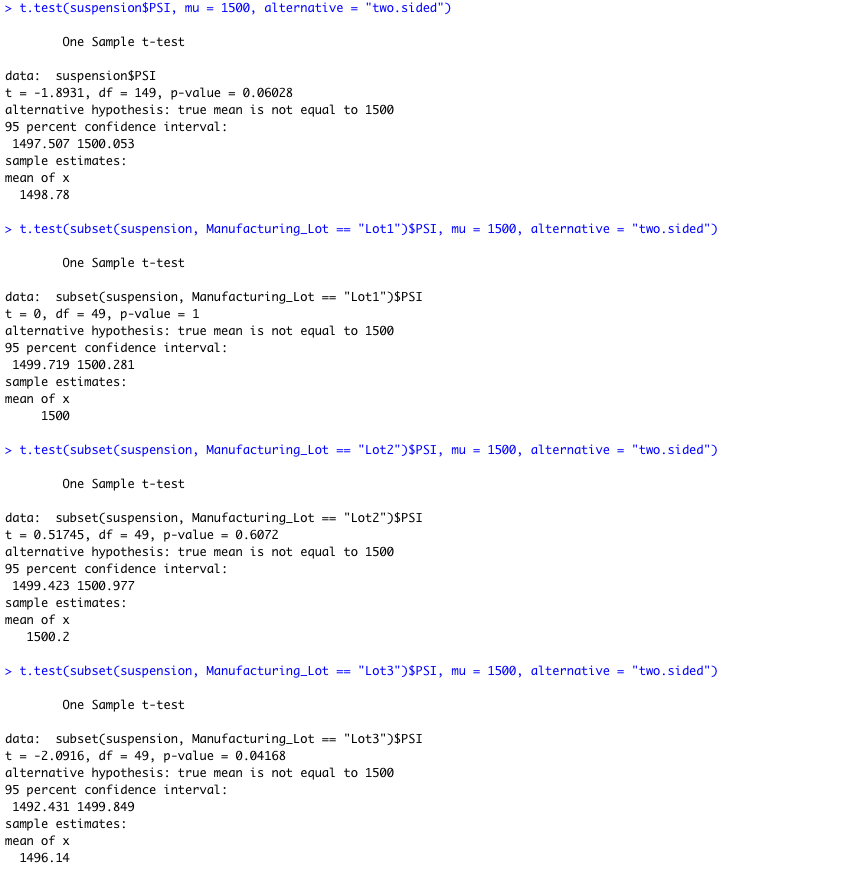

# MechaCar_Statistical_Analysis
 

Tyrone Fraley 
UC Berkley Extension 
Dec 20, 2022 

 

  

 

## Linear Regression to Predict MPG

The Pr(>|t|) points to the probability that the coefficients within the data frame may contribute to a random variance amongst this model. Zach (2021) the Pr(>|t|) column exemplifies the p-value when analogous with the t value column. At this moment, one would want to understand if the coefficient's values in the Pr(>|t|) column are greater or less than 0.05. When analyzing the results spoiler_angle (Pr(>|t|) = 0.3069) and AWD (Pr(>|t|) 0.1852) were unlikely to be random.
The p-value of this data sset is 5.35e-11 which means that the significance level is smaller than 0.05%. Knowing this one can validate that there is enough evidence to support that the slope of the linear model is not zero.

Does this linear model predict mpg of MechaCar prototypes effectively? Why or why not?
To better understand if the linear model is predicting mpg of MechaCar prototypes effectively. It would be important to refer to the r-squared value. The r-squared value is 0.7149. This allows for the data set to be effectively predicted 71 out of 100 times. 
 

  

 
 

  

 
## Summary Statistics on Suspension Coils
The next part of the analysis was to create visualizations for the trip analysis. To do so the MechaCar Suspension_Coil.csv data was imported into R. Within this data set there were weight capacities for many suspension coils. Each were tested to determine if the current process of manufacturing was consistent amongst production lots. However, suspension coils must not exceed 100 pounds per square inch. To understand this phenomena R was used to find the mean, median, variance, and standard deviation of the data into a data frame called "total_summary". In R this function was total_summary <- suspension %>% summarize(mean = mean(PSI), median = median(PSI), variance = var(PSI), standard_deviation = sd(PSI)). Next, the "lot_summary" dataframe was created to display the manufacturing lot, as well as the mean, median, variance, and standard deviation. To perform this calculation in R the following function was used: lot_summary <- suspension %>% group_by(Manufacturing_Lot) %>% summarize(mean = mean(PSI), median = median(PSI), variance = var(PSI), standard_deviation = sd(PSI)). 
Once the dataframes were complete the variance in the "total_summary" data set. It resulted in 62.29356 PSI which meets specifications. However, this was not the result when looking at each individual lot in the "lot_summary" dataframe. Lot 1 had a variance of 0.9795918. Lot 2 had a variance of 7.4693878. Finally, Lot 3 had a variance of 170.2861224. The results show that Lots 1 and 2 met specifications and Lot 3 would have to be closer examined and compared to that of Lots 1 and 2 to better understand what phenomena is occuring to make Lot 3 not meet specifications.
 

  

 
 

  

 
## T-Tests on Suspension Coils
Using R to perform t-tests. The suspsension coil data set could be further examined to see if the lots differ from one another. In so much as, if they differ from the population mean (1500 psi). Passing the first t.test all lots were taken into consideration (t.test(suspension$PSI, mu = 1500, alternative = "two.sided")). This test yeilded a p-value of 0.06028 which could allow one to reject the idea that the lots differ from one another. When looking at each lot individually. T-tests for each lot would need to be performed (t.test(subset(suspension, Manufacturing_Lot == "Lot1")$PSI, mu = 1500, alternative = "two.sided")). Lot 1 yeilded a p-value of 1, Lot 2 yeilded a p-value of 0.6, and Lot 3 yeilded a p-value of 0.04. Lot 3 was the only lot that had a p-value less than 0.5. Despite this, each Lot yeilded a confidence interfal of 95 percent which means they are close to eachother in regards to being at 1500 psi. 
 

  

 
## Study Design: MechaCar vs Competition
For future research it would be interesting to compare MechaCar against their competition. Considering, suspension could affect vehicle safety. It would be interesting to compare vehicle suspension and vehicle safety against MechaCare and their competitors. The null hypothesiss would be that the competing manufacturers' suspension and safety ratings do not differ amongst class. However, the alternative hypothesis would be that the competing manufacturers' suspension and safety ratings do differ amongst class. This could be done through a two-way ANOVA test. To conduct this test one would need suspension standards and safety ratings (related to accidents caused by faulty suspension systems) among 10 manufacturers (MechaCar included). Competing manufactuers would be first selected by class and then vehicles would be selected by full line up based on vehicle type. To reach saturation data collected could be at 100 instances for each vehicle selected. 

References:
Zach. (2021). How to Interpret Pr(>|t|) in Regression Model Output in R. Statology. https://www.statology.org/interpret-prt-regression-output-r/
